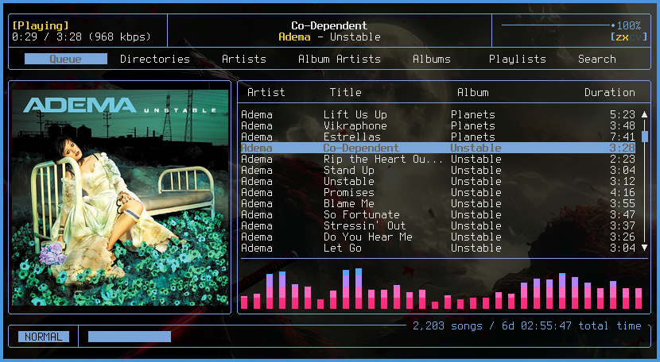

# stem

**st, enhanced & merged.** A curated build of [suckless st](https://st.suckless.org/) with the patches you actually want — already applied, already resolved, already working together — and configured the way you configure any other X app: through `~/.Xresources`.

> **New to st?** st (the "simple terminal") is a minimal, fast terminal emulator for X from the [suckless](https://suckless.org/) project. It deliberately ships only the essentials and keeps its codebase tiny — you add any extra features yourself by patching the source. That minimalism is the whole appeal, and also the catch.

Normally, getting the features you want means downloading st's source, hand-applying patches in C, fixing the conflicts where they collide, and recompiling for every change. stem does that for you: the patches come pre-applied and reconciled with one another in one cohesive build. Dropping a single patch like kitty graphics onto plain st is easy; the work is getting a whole stack of them to coexist without colliding — and that part is already done. Day-to-day configuration — your colors, font, and opacity — needs no C and no recompile.

> st is the root. stem is what grows from it — maintained and kept alive, not a frozen pile of patches.



*stem with the kitty graphics patch: album art rendered inline in [rmpc](https://github.com/mierak/rmpc), running over an SSH session. Background transparency via the alpha patch.*

## Notable Features

All of this is on by default — no patches to pick, nothing to toggle: 

- **Configured via Xresources** — colors, font, opacity and more all live in `~/.Xresources`.
- **Kitty graphics protocol** — display real images inline, including over SSH: the image data travels inline in the terminal stream, so it renders from remote machines just as it does locally.
- **Synchronized output (mode `2026`)** — flicker-free redraws for TUIs and full-screen apps that opt in
- **Alpha / transparency** — true background transparency, opacity set from Xresources
- **Scrollback** — scroll through terminal history
- **Keyboard select** — select and copy text entirely from the keyboard, vim-style
- **Lightweight** — one small binary, linking only the standard X libraries and imlib2. It's st underneath; it stays close to st's footprint.

## Install

### Arch Linux (AUR)

```sh
# stable release
yay -S stem
```

Or with `paru`, or by cloning the AUR repo and running `makepkg -si`.

stem installs its binary as **`st`** and declares `provides=('st')` / `conflicts=('st')`, so it's a true drop-in replacement for the official `st` package. Anything that launches `st` — your window manager keybinds, `$TERMINAL`, `.desktop` Exec lines — keeps working with no changes.

### Build from source (any distro)

Dependencies (Xorg/X11):

- a C compiler and `make`
- `fontconfig`, `freetype2`
- `libX11`, `libXft`, `imlib2`

> stem is an X11 application, like st itself. It runs fine on Wayland compositors through **Xwayland**, but there's no native Wayland backend.

```sh
git clone https://github.com/deonspengler/stem.git
cd stem
sudo make clean install
```

This installs the `st` binary and the `st`/`st-256color` terminfo entries. To uninstall: `sudo make uninstall`. You don't need to edit anything before building — all appearance settings come from Xresources at runtime (see below).

## Configuration

stem reads its configuration from your X resources, so there's no need to edit `config.h` and recompile just to change colors or fonts. Put your settings in `~/.Xresources` — here's a representative starting point:

```
! Font
st.font:          monospace:size=11

! Transparency (0.0 = fully transparent, 1.0 = opaque)
st.alpha:         0.92

! Base colors
st.background:    #1e1e2e
st.foreground:    #cdd6f4
st.cursorColor:   #f5e0dc

! 16-color palette (st.color0 through st.color15)
st.color0:        #45475a
st.color1:        #f38ba8
st.color2:        #a6e3a1
st.color3:        #f9e2af
! … st.color4 through st.color15

! Padding around the text area, in pixels
st.borderpx:      14
```

This is just a sample. For the complete list of supported resources, see **`man st`**.

Load them and open a new terminal:

```sh
xrdb ~/.Xresources
```

Add `xrdb ~/.Xresources` to your `~/.xinitrc` (or your WM/DE startup) so your settings apply on login. Changes take effect for terminals started after the `xrdb` reload; existing windows keep the settings they launched with.

> **Advanced:** keybindings and low-level defaults still live in `config.def.h` for anyone who wants them, in the usual suckless way. You never need to for normal use — everything in the example above is runtime Xresources.

### A note on `TERM`

stem keeps `TERM=st-256color`, so ncurses applications behave exactly as they do under stock st. If you SSH into a machine that doesn't have st's terminfo, copy it over with `infocmp` or fall back to `TERM=xterm-256color` for that session.

## Usage

A few of the keybindings you'll reach for most:

| Action | Default |
| --- | --- |
| Copy selection | `Ctrl` + `Shift` + `C` |
| Paste | `Ctrl` + `Shift` + `V` |
| Scroll back / forward | `Shift` + `PageUp` / `PageDown`, or mouse wheel |
| Keyboard select mode | `Ctrl`+`Shift`+`Escape` |

For the full list of keybindings, see **`man st`**.

In keyboard-select mode you move the cursor and select text with the keyboard (vim-style motions), then yank — no mouse required.

## Displaying images

stem implements the kitty graphics protocol, so it can show real images inline — it renders whatever a supporting application sends it. The quickest way to see it is to hand an image to a tool that speaks the protocol:

```sh
chafa -f kitty image.png      # general image-to-terminal renderer
```

File managers with image previews work too — [yazi](https://github.com/sxyazi/yazi), for instance, renders thumbnails inline as you browse. And full applications can use the protocol for their own UI: the screenshot at the top is [rmpc](https://github.com/mierak/rmpc), an MPD client showing album art inline — over SSH, no less.

stem doesn't render images on its own; it always displays what an application sends, so you'll be driving it through a tool like these.

## Why stem?

The usual way to get a loaded st is something like [st-flexipatch](https://github.com/bakkeby/st-flexipatch): a build where you pick the patches you want by toggling them, and the bundled combinations are pre-reconciled so they compile. It's a kit you tailor and build yourself — and it's bounded by what's bundled. Notably, it doesn't include the kitty graphics protocol, so the hardest integration to get right is one you'd still be hand-patching.

stem takes the opposite approach: rather than a kit to assemble, it's one curated, already-integrated build — kitty graphics included — that you install and then configure at runtime through Xresources. No choosing patches, no compiling to change your colors, and the result is maintained as a whole.

## FAQ

### My Xresources colors or font aren't applying — what's wrong?

Run `xrdb ~/.Xresources` and open a *new* terminal — existing windows keep what they launched with. Make sure your login starts with the resources loaded (an `xrdb` line in `~/.xinitrc` or your compositor's startup).

### Does it work on Wayland?

Yes, through Xwayland. There's no native Wayland backend (same as upstream st).

### Why won't images show up?

The kitty graphics protocol means stem *can* display images, but something has to send them — run a tool that emits kitty graphics escape sequences. The terminal won't render images on its own.

### Do images work over SSH?

Yes, when the remote tool sends the image data inline (the normal case) — it travels in the terminal stream like any other output. Tools that instead rely on writing a local temp file won't work remotely, since the remote disk isn't yours.

### How do I go back to plain st?

Because stem `provides`/`conflicts` with `st`, just uninstall stem and install the official `st` package.

### Can I still change keybindings or low-level defaults?

Yes — those live in `config.h`, edited and recompiled the usual suckless way. Only appearance is handled at runtime via Xresources.

## Contributing

Contributions are welcome — bug reports, patch suggestions, terminfo/packaging fixes, and screenshots all help.

- Open an issue describing the patch or change and why it belongs in a curated build.
- Keep the suckless spirit: small, readable diffs; no feature creep that fights the existing set.
- Because patches here are pre-merged, a new patch needs to be reconciled against the others — note any conflicts you hit and how you resolved them.

## Credits

stem stands entirely on the work of others:

- The [suckless](https://suckless.org/) project and the authors of **st**.
- The authors of every patch bundled here — see [st.suckless.org/patches](https://st.suckless.org/patches/) and the upstream sources for each.

If your patch is included and you'd like different or additional attribution, please open an issue.

## License

stem is distributed under the **MIT/X Consortium License**, the same license as upstream st. See [LICENSE](LICENSE) for the full text and copyright notices, which retain the original st and patch authors alongside this build's contributors.
